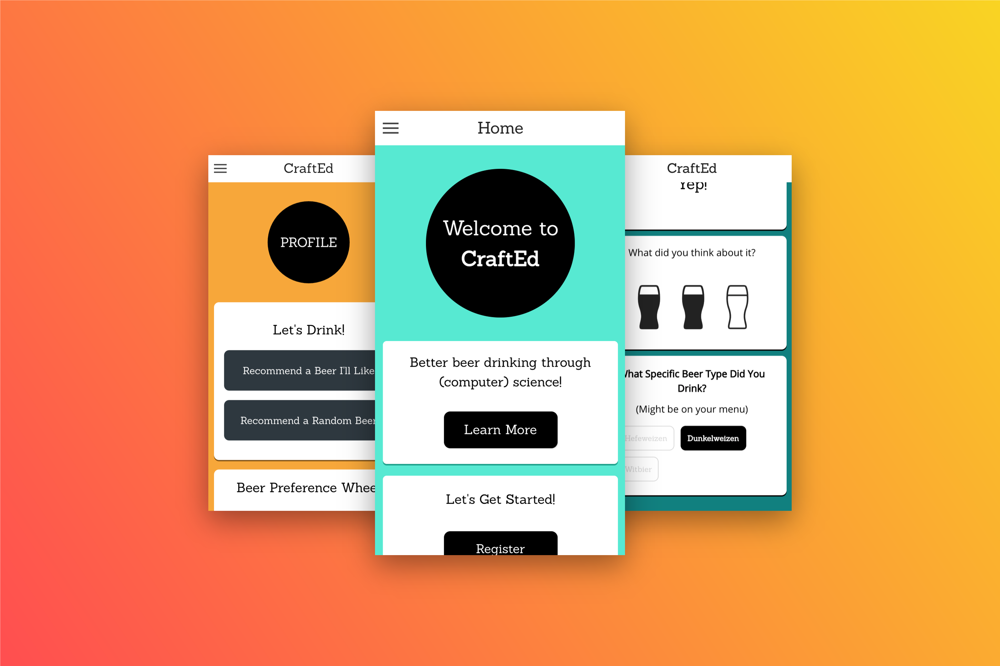

# Welcome to CraftEd
### Now available on [iOS Appstore](https://itunes.apple.com/WebObjects/MZStore.woa/wa/viewSoftware?id=1188125687&mt=8)



**CraftEd is a hybrid mobile web application that help users discover(or rediscover) their beer palate.**

>By ordering beers based off of our recommendation and submitting ratings for these beers, CraftEd's algorithm will help you find your favorite flavors of beer with each rating you submit!


## Develop
Clone this repo and run `npm install` to download all relevant packages.

To view the app in browser:
````
$ ionic serve
````

To view the app in native iOS:
```
$ ionic build ios
$ ionic emulate
```

More detailed instructions can be found [here](https://ionicframework.com/docs/guide/testing.html).

#### SCSS
For scss auto-compilation, run:

```
$ sass --watch scss/ionic.app.scss:www/css/ionic.app.css
```

## Features

*  Front-end app platform built with the [Ionic Framework](https://ionicframework.com/)
*  Algorithm and data processing is done with our Ruby on Rails API, hosted on Heroku
*  Beer recommendations becomes more specific with each subsequent rating
*  [D3 JS](http://bl.ocks.org/mbostock/4063423) Wheel gives a visual and interactive indications of user beer preference

## Contributing
**Bug Reports & Feature Requests**

Please use the github issues tracker to report any bugs or file feature requests.

## License
CraftEd is released under the [MIT License](http://www.opensource.org/licenses/MIT).
